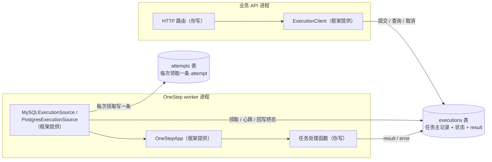
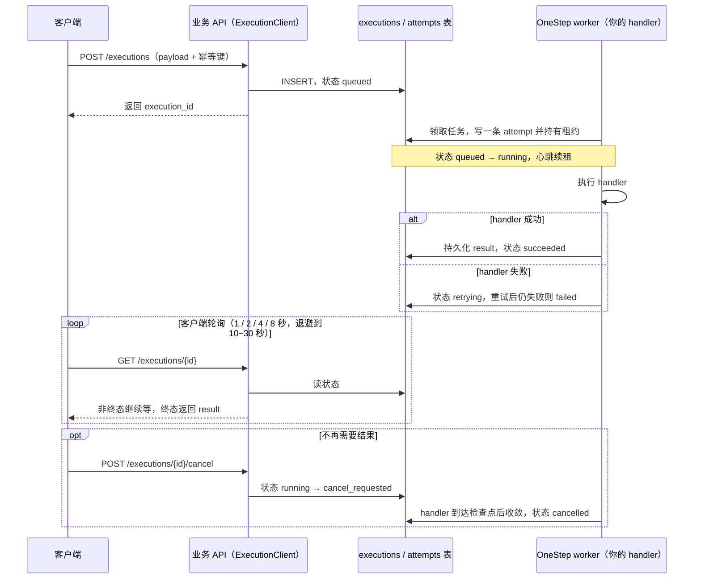
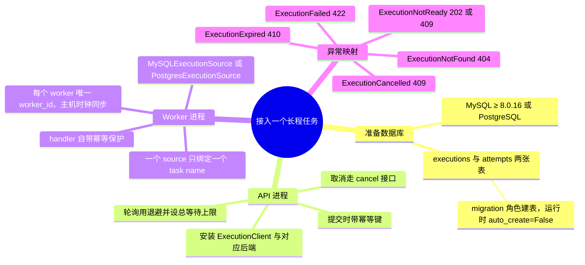

# 长程任务如何工作

这一页用三张图说明**应用**长程任务（Tracked Execution）时，你的系统如何与 onestep 协作跑完一个长任务：谁负责什么、数据流向哪里、接入前要准备什么。两个后端的部署细节见 [MySQL Tracked Execution](/broker/mysql-execution) 与 [PostgreSQL Tracked Execution](/broker/postgres-execution)。

## 三个角色

整个应用一共三个组件。虚线框外是 onestep 提供的，你只写 API 路由和任务处理函数。

| 代码 | 谁提供 |
| --- | --- |
| HTTP 路由（提交 / 查询 / 取消） | 你写 |
| 任务处理函数（handler） | 你写 |
| `ExecutionClient` / `ExecutionSource` / `OneStepApp` | onestep |
| 两张表的 DDL 与状态流转 | onestep（建议 migration 角色建表，运行时 `auto_create=False`） |

任务状态就是数据库里的行，不经过任何消息队列。API 进程和 worker 进程互不直连，只通过同一组表协作。

## 一次任务的完整流程

要点：

- **提交带幂等键**：同一幂等键重复提交返回同一条 execution，不会重复执行。
- **终态只有四个**：`succeeded` / `failed` / `cancelled` / `expired`；`queued` / `running` / `retrying` / `cancel_requested` 都是非终态，客户端继续等待。
- **取消是协作式的**：`cancel_requested` 只是请求，worker 在 handler 的下一个检查点收敛为 `cancelled`，不保证立即停止。

## 接入前要准备什么

各状态的完整业务语义、异常映射表、部署步骤、上线清单与回滚，见对应后端页：

- [MySQL Tracked Execution](/broker/mysql-execution)
- [PostgreSQL Tracked Execution](/broker/postgres-execution)
