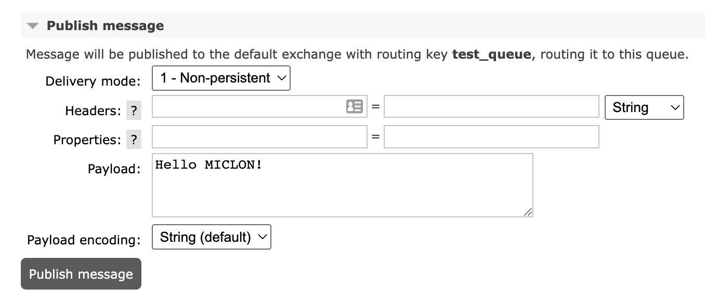
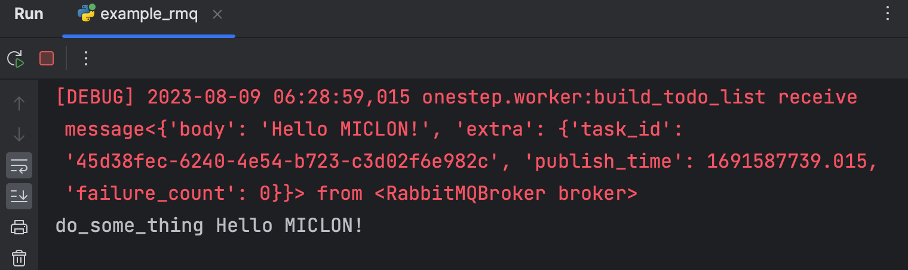

## RabbitMQBroker

`RabbitMQBroker` 是基于 [RabbitMQ](https://www.rabbitmq.com/) 消息队列中间件的 MQ 服务。

这也是分布式任务中最为核心的broker。利用此broker，可以搭建一个分布式任务调度平台，实现任务的异步分发、执行与调度。

在使用前请先确保已正确安装RabbitMQ服务，并正确配置了RabbitMQ的连接信息。

为了方便，我们在本地使用 **docker** 快速搭建一个 RabbitMQ 服务。

```bash
docker run -d --name rabbitmq  --restart=always -p 5672:5672 -p 15672:15672 --hostname rabbitmq -e RABBITMQ_DEFAULT_VHOST=/ -e RABBITMQ_DEFAULT_USER="admin" -e RABBITMQ_DEFAULT_PASS="admin" rabbitmq:3-management
```

启动成功后，可以在浏览器中访问 `http://localhost:15672` 登录 RabbitMQ 管理界面，默认用户名和密码均为 `admin`。


```python
from onestep import RabbitMQBroker

rmq_broker = RabbitMQBroker(
    "test_queue",
    {
        "username": "admin",
        "password": "admin",
    }
)
@step(from_broker=rmq_broker)
def do_some_thing(message):
    print("do_some_thing", message.body)

step.start(block=True)
```

::: tip
您不必担心MQ服务中还未申明`test_queue`队列，当
`RabbitMQBroker`实例化时，会自动创建队列。
:::

此时我们可以在RabbitMQ管理界面中看到一个名为`test_queue`的队列。尝试在这个队列手动模拟发送一条消息，并查看是否被`do_some_thing`消费。





> 消息还附带一些元信息，大部分情况下您都不必关心它们的存在。

通常，在接收到消息后，我们需要对消息进行处理，并返回处理结果。

可能这个结果会交给下游的MQ继续处理，也可能是插入到数据库中，也可能是返回给用户。

接下来我继续在`@step`装饰器上做点文章，在`do_some_thing`函数中，我使用`return`/`yield` 将处理结果返回给下游的MQ。

```python

# return的消息将发往to_broker
@step(from_broker=rmq_broker, to_broker=rmq_broker2)
def build_todo_list(message):
    print("do_some_thing", message.body)
    message.body = "I am done."
    return message


# 监控rmq_broker2
@step(from_broker=rmq_broker2)
def finish_job(message):
    print("finish_job", message.body)
    return message
```

控制台输出：
```
do_some_thing Hello MICLON!
finish_job I am done.
```
