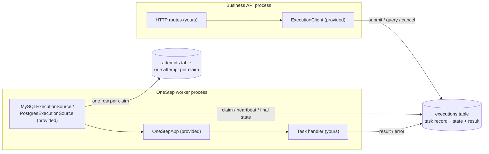
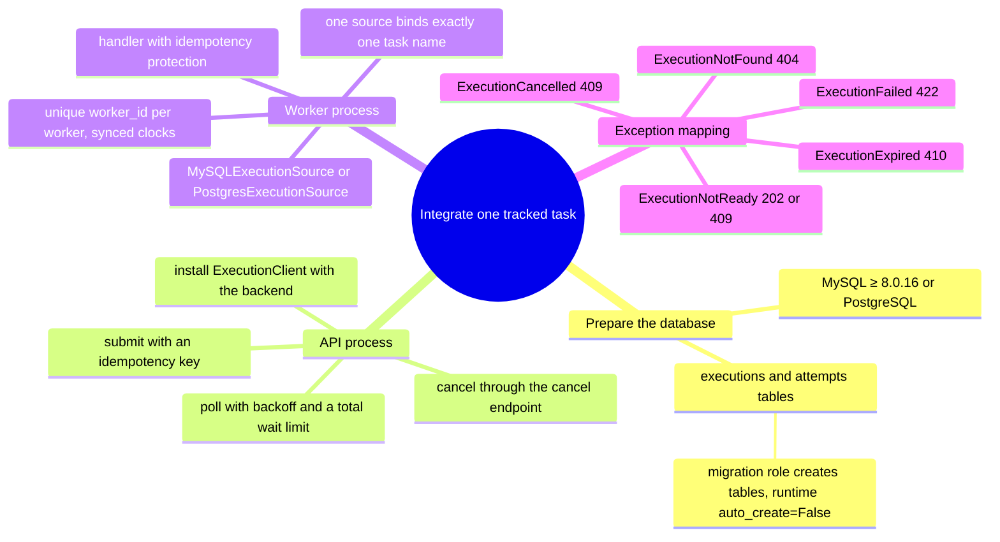

# How Tracked Execution Works

This page uses three diagrams to show how your system works together with onestep to run a long task when you **apply** Tracked Execution: who is responsible for what, where the data flows, and what to prepare before integrating. Deployment details for both backends are covered in [MySQL Tracked Execution](/en/broker/mysql-execution) and [PostgreSQL Tracked Execution](/en/broker/postgres-execution).

## Three Roles

There are three components in the application. Outside the dashed boxes everything is provided by onestep; you only write the API routes and the task handler.



| Code | Provided by |
| --- | --- |
| HTTP routes (submit / query / cancel) | You |
| Task handler | You |
| `ExecutionClient` / `ExecutionSource` / `OneStepApp` | onestep |
| DDL for the two tables and state transitions | onestep (create tables as migration role, run with `auto_create=False`) |

Task state is a row in the database; no message queue is involved. The API process and the worker process never talk directly — they cooperate through the same set of tables.

## Lifecycle of One Task

```mermaid
sequenceDiagram
    participant C as Client
    participant API as Business API (ExecutionClient)
    participant DB as executions / attempts tables
    participant W as OneStep worker (your handler)

    C->>API: POST /executions (payload + idempotency key)
    API->>DB: INSERT, state queued
    API-->>C: returns execution_id
    W->>DB: claim task, insert one attempt, hold lease
    Note over W,DB: state queued → running, heartbeat renews lease
    W->>W: run handler
    alt handler succeeds
        W->>DB: persist result, state succeeded
    else handler fails
        W->>DB: state retrying, then failed after retry limit
    end
    loop Client polls (1 / 2 / 4 / 8 s, back off to 10~30 s)
        C->>API: GET /executions/{id}
        API->>DB: read state
        API-->>C: non-terminal: keep waiting; terminal: return result
    end
    opt Result no longer needed
        C->>API: POST /executions/{id}/cancel
        API->>DB: state running → cancel_requested
        W->>DB: converges at the next checkpoint, state cancelled
    end
```

Key points:

- **Submit with an idempotency key**: submitting the same key again returns the same execution instead of running it twice.
- **Only four terminal states**: `succeeded` / `failed` / `cancelled` / `expired`; `queued` / `running` / `retrying` / `cancel_requested` are non-terminal and the client keeps waiting.
- **Cancellation is cooperative**: `cancel_requested` is only a request; the worker converges to `cancelled` at the handler's next checkpoint and does not guarantee an immediate stop.

## What to Prepare Before Integrating



For the full business semantics of each state, the exception mapping table, deployment steps, the go-live checklist, and rollback, see the backend pages:

- [MySQL Tracked Execution](/en/broker/mysql-execution)
- [PostgreSQL Tracked Execution](/en/broker/postgres-execution)
