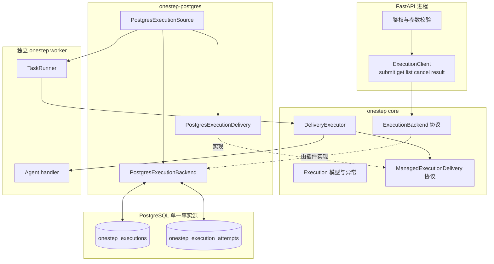
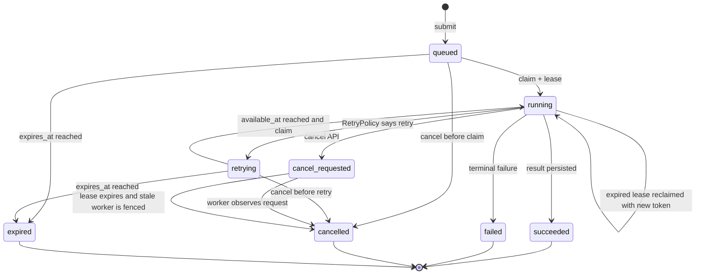
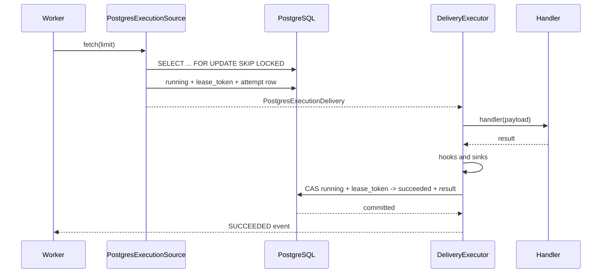

# PostgreSQL Execution Backend 设计

## 1. 决策摘要

onestep 可以增加类似 Celery `AsyncResult` 的任务提交与查询能力，但不应把自己扩张成完整工作流平台。

首期采用以下方案：

- core 新增可选的 `ExecutionBackend`、`ExecutionClient`、执行快照和受管 Delivery 协议。
- `onestep-postgres` 实现任务提交、持久化、领取、租约、心跳、状态、结果和取消。
- PostgreSQL 同时作为队列与执行状态的单一事实源，一次提交只写一个数据库事务。
- FastAPI 和 onestep worker 是两个独立进程，各自持有 PostgreSQL 连接。
- worker 继续使用现有 `Source -> Delivery -> DeliveryExecutor` 主链路。
- 普通 `Delivery.ack()`、`retry()`、`fail()` 的签名和行为不变；只有 PostgreSQL execution delivery 使用可选的受管完成能力。
- 不引入独立 Job Gateway、DAG、任务链、强制终止和 exactly-once 承诺。

这是一项公开 API 增量能力。按照本文边界实施，公开 API 破坏性低，运行时热路径回归风险中等，数据库并发与租约语义是主要工程风险。

## 2. 问题定义

FastAPI 收到一个需要长时间运行 Agent 的请求时，不应在 HTTP 请求生命周期内等待任务完成。业务方需要：

1. 提交一个已注册的 onestep 任务并立即取得稳定 ID。
2. 按 ID 查询状态。
3. 分页查询历史任务。
4. 任务成功后取得结果，失败后取得可公开的错误摘要。
5. 请求协作式取消。
6. Web 进程或 worker 重启后，任务记录仍然存在。
7. 多 worker 并发领取时，同一时刻只有一个有效租约拥有者可以提交最终状态。

仅使用现有 `postgres_table_queue` 可以完成业务 PoC，但每个业务都需要重复实现状态机、租约、结果、取消、幂等提交和查询分页。该能力应由 onestep 提供统一语义。

## 3. 目标与非目标

### 3.1 目标

- 提供稳定、异步、适合 FastAPI 的 `step.submit/get/list/cancel/result` API。
- 返回不可变 `Execution` 快照，属性访问不触发数据库查询。
- 使用 PostgreSQL 保证提交、领取和状态迁移的事务一致性。
- 支持 worker 崩溃后的租约恢复和 fencing，防止旧 worker 覆盖新结果。
- 复用现有 handler、hooks、sink、RetryPolicy、dead-letter 和 TaskEvent 行为。
- 保持没有 execution backend 的任务行为不变。
- 为未来的其它 backend 或“消息 broker + result store”组合保留 core 协议边界。

### 3.2 非目标

- 不实现 Celery Canvas 的 chain、group、chord、signature。
- 不实现 Airflow、Temporal 类 DAG 或工作流编排。
- 不提供跨语言 HTTP Job Gateway。
- 不强制杀死线程、进程或远端 Agent。
- 不保证 handler 外部副作用 exactly-once。
- 不在首期内置对象存储结果后端；超过内联结果限制时，业务先把大对象写入对象存储，再把 URI 和摘要作为普通 JSON 结果返回。
- 不让控制面 TaskEvent 成为业务任务状态的权威数据源。
- 不改变现有 `Delivery` 抽象方法签名、`Envelope` 必填字段或 TaskEvent kind。

## 4. 从 Celery 借鉴什么

Celery 将几个概念分开：

| Celery 概念 | 作用 | onestep 对应设计 |
| --- | --- | --- |
| `delay()` / `apply_async()` | 异步提交并返回 ID | `await step.submit()` |
| `AsyncResult` | 按任务 ID 操作结果 | 不可变 `Execution` 快照 + `ExecutionClient` |
| `status` / `ready()` | 查询执行状态 | `await step.get()` 后读取 `status` / `terminal` |
| `get()` | 等待并取得结果 | 首期 `result()` 只查询一次，不在库内隐式阻塞 |
| `revoke()` | 请求撤销或终止 | `cancel()` 仅协作式取消，不承诺强制终止 |
| broker | 传输待执行消息 | 首期由 PostgreSQL execution 表承担 |
| result backend | 保存状态和结果 | 首期仍由同一 PostgreSQL 表承担 |

借鉴 Celery 的“提交与结果句柄分层”，但不照搬以下行为：

- 不使用会在属性访问时隐式访问网络的动态对象。
- 不提供同步阻塞 `get()`，避免在 FastAPI event loop 中误用。
- 不把 revoke 等价为已经停止业务副作用。
- 不在首期拆分 broker 和 result backend，避免消息发送与状态写入的双写窗口。

未来确实需要 RabbitMQ/SQS 吞吐量时，可以增加组合 backend，使用 Outbox 或明确的提交协议连接 broker 与 result store；这不是 PostgreSQL 首期的前置条件。

## 5. 外部 API 契约

### 5.1 FastAPI 初始化

业务进程使用 core 的稳定客户端，PostgreSQL 插件提供 backend：

```python
from contextlib import asynccontextmanager

from fastapi import FastAPI
from onestep import ExecutionClient
from onestep_postgres import PostgresConnector

pg = PostgresConnector("postgresql+psycopg://app:secret@db/app")
backend = pg.execution_backend(
    table="onestep_executions",
    attempts_table="onestep_execution_attempts",
    auto_create=True,
)
step = ExecutionClient(backend, namespace="agent-api")


@asynccontextmanager
async def lifespan(_app: FastAPI):
    await backend.open()
    try:
        yield
    finally:
        await pg.close()


api = FastAPI(lifespan=lifespan)
```

`namespace` 隔离共享表中的不同业务应用，也是幂等键和 worker 领取的作用域。生产环境可以在部署阶段建表，然后把 `auto_create` 设为 `False`，避免运行身份持有 DDL 权限。

### 5.2 客户端方法

```python
class ExecutionClient:
    def __init__(
        self,
        backend: ExecutionBackend,
        *,
        namespace: str,
    ) -> None: ...

    async def submit(
        self,
        task_name: str,
        payload: object,
        *,
        idempotency_key: str | None = None,
        metadata: Mapping[str, object] | None = None,
        delay_s: float | None = None,
        expires_at: datetime | None = None,
    ) -> Execution: ...

    async def get(self, execution_id: UUID | str) -> Execution | None: ...

    async def list(
        self,
        *,
        task_name: str | None = None,
        status: ExecutionStatus | None = None,
        limit: int = 50,
        cursor: str | None = None,
    ) -> ExecutionPage: ...

    async def cancel(
        self,
        execution_id: UUID | str,
        *,
        reason: str | None = None,
    ) -> Execution | None: ...

    async def result(self, execution_id: UUID | str) -> object: ...
```

方法语义：

| 方法 | 数据库访问 | 返回或异常 |
| --- | --- | --- |
| `submit` | 一次事务 | 返回 `queued` 或幂等命中的既有快照 |
| `get` | 一次查询 | 不存在时返回 `None` |
| `list` | 一次游标分页查询 | 返回 `ExecutionPage(items, next_cursor)` |
| `cancel` | 一次条件更新 | 不存在时返回 `None`；终态调用幂等返回原快照 |
| `result` | 一次查询 | 成功返回结果；未完成或终态失败抛出类型化异常 |

`result()` 不轮询、不等待。等待策略属于 HTTP 层、调用方或未来独立的 `wait()` API，不能隐藏在快照属性中。

### 5.3 快照模型

```python
class ExecutionStatus(str, Enum):
    QUEUED = "queued"
    RUNNING = "running"
    RETRYING = "retrying"
    SUCCEEDED = "succeeded"
    FAILED = "failed"
    CANCEL_REQUESTED = "cancel_requested"
    CANCELLED = "cancelled"
    EXPIRED = "expired"


@dataclass(frozen=True)
class ExecutionError:
    kind: str
    exception_type: str
    stage: str | None = None
    backend: str | None = None
    operation: str | None = None
    connector_kind: str | None = None


@dataclass(frozen=True)
class Execution:
    id: UUID
    namespace: str
    task_name: str
    status: ExecutionStatus
    payload: object
    metadata: Mapping[str, object]
    result: object | None
    error: ExecutionError | None
    attempts: int
    created_at: datetime
    available_at: datetime
    started_at: datetime | None
    finished_at: datetime | None
    cancel_requested_at: datetime | None
    expires_at: datetime | None
    version: int

    @property
    def terminal(self) -> bool: ...
```

`frozen=True` 表示快照字段不能被重新赋值；每次 `get/list/cancel` 都返回新快照。`payload`、`metadata` 和 `result` 在构造时深拷贝，防止 backend 内部缓存被调用方修改。

### 5.4 `result()` 异常

- `queued/running/retrying/cancel_requested`：抛出 `ExecutionNotReady`，异常携带当前快照。
- `failed`：抛出 `ExecutionFailed`，异常携带 `ExecutionError`。
- `cancelled`：抛出 `ExecutionCancelled`。
- `expired`：抛出 `ExecutionExpired`。
- ID 不存在：抛出 `ExecutionNotFound`。
- `succeeded`：返回快照中的 `result`，包括合法的 `None`。

### 5.5 FastAPI 路由示例

```python
from uuid import UUID

from fastapi import APIRouter, HTTPException, Response, status

router = APIRouter(prefix="/agent-runs")


@router.post("", status_code=status.HTTP_202_ACCEPTED)
async def submit_agent_run(request: AgentRunRequest):
    execution = await step.submit(
        "run_agent",
        request.model_dump(),
        idempotency_key=request.idempotency_key,
        metadata={"requested_by": request.requested_by},
    )
    return {"task_id": execution.id, "status": execution.status}


@router.get("/{task_id}")
async def get_agent_run(task_id: UUID):
    execution = await step.get(task_id)
    if execution is None:
        raise HTTPException(status_code=404, detail="task not found")
    return execution


@router.post("/{task_id}/cancel")
async def cancel_agent_run(task_id: UUID):
    execution = await step.cancel(task_id)
    if execution is None:
        raise HTTPException(status_code=404, detail="task not found")
    return execution


@router.get("/{task_id}/result")
async def get_agent_result(task_id: UUID, response: Response):
    execution = await step.get(task_id)
    if execution is None:
        raise HTTPException(status_code=404, detail="task not found")
    if not execution.terminal:
        response.status_code = status.HTTP_202_ACCEPTED
        return {"task_id": task_id, "status": execution.status}
    if execution.status is not ExecutionStatus.SUCCEEDED:
        raise HTTPException(
            status_code=409,
            detail={"status": execution.status, "error": execution.error},
        )
    return {"task_id": task_id, "result": execution.result}
```

HTTP 鉴权、租户权限和“该用户是否能读取这个 task ID”由 FastAPI 负责。`ExecutionClient.namespace` 是数据隔离边界，不代替业务授权。

## 6. 总体架构



边界职责：

| 组件 | 职责 | 不负责 |
| --- | --- | --- |
| `ExecutionClient` | 参数校验、namespace 绑定、快照和类型化结果 API | SQL、领取、心跳 |
| `ExecutionBackend` | 提交、查询、分页、取消的稳定协议 | HTTP、业务鉴权 |
| `PostgresExecutionBackend` | PostgreSQL schema、事务、CAS、序列化和错误归一化 | handler 执行 |
| `PostgresExecutionSource` | 按 namespace/task 领取、回收过期租约、构造 Delivery | 业务结果解释 |
| `PostgresExecutionDelivery` | 心跳、fencing、受管完成、取消传播 | 重试策略决策 |
| `DeliveryExecutor` | handler、hooks、sink、RetryPolicy、dead-letter、完成分支 | PostgreSQL SQL |
| FastAPI | HTTP、鉴权、授权、请求模型、状态码 | 执行 Agent |

## 7. Worker 接入

### 7.1 Python 接入

```python
from onestep import ExponentialBackoff, OneStepApp
from onestep_postgres import PostgresConnector

app = OneStepApp("agent-api")
pg = PostgresConnector("postgresql+psycopg://app:secret@db/app")
backend = pg.execution_backend(auto_create=True)
jobs = backend.source(
    namespace="agent-api",
    task_names=("run_agent",),
    batch_size=4,
    poll_interval_s=0.5,
    lease_duration_s=90,
    heartbeat_interval_s=30,
    worker_id="agent-worker-1",
)
app.register_resource("postgres", pg)


@app.task(
    name="run_agent",
    source=jobs,
    concurrency=4,
    retry=ExponentialBackoff(max_attempts=3, min_delay_s=2, max_delay_s=30),
    timeout_s=1800,
)
async def run_agent(ctx, payload):
    return await agent.run(payload)
```

`task_names` 必须显式配置。没有独立 Gateway 或任务注册中心时，FastAPI 也必须只提交已部署 worker 能处理的任务名；未知任务不会被该 source 领取。

### 7.2 YAML 接入

首期只新增 `postgres_execution_source`，不新增 resource catalog 的 `execution_backend` role。这样不需要修改 catalog role、控制面过滤和 CLI role 参数。

```yaml
resources:
  pg:
    type: postgres
    dsn: "${POSTGRES_DSN}"

  agent_jobs:
    type: postgres_execution_source
    connector: pg
    namespace: agent-api
    task_names: [run_agent]
    table: onestep_executions
    attempts_table: onestep_execution_attempts
    batch_size: 4
    poll_interval_s: 0.5
    lease_duration_s: 90
    heartbeat_interval_s: 30
    worker_id: "${HOSTNAME:-agent-worker}"
    auto_create: true

tasks:
  - name: run_agent
    source: agent_jobs
    handler:
      ref: agent_worker.tasks:run_agent
    concurrency: 4
    retry:
      type: exponential_backoff
      max_attempts: 3
      min_delay_s: 2
      max_delay_s: 30
    timeout_s: 1800
```

FastAPI 仍通过 Python `ExecutionClient` 使用同一表。YAML 是 worker wiring，不承担 HTTP 客户端定义。

## 8. Core 扩展协议

### 8.1 Backend 协议

core 定义业务侧稳定协议，不包含 PostgreSQL 参数：

```python
class ExecutionBackend(Protocol):
    async def submit(self, request: ExecutionRequest) -> Execution: ...
    async def get(self, namespace: str, execution_id: UUID) -> Execution | None: ...
    async def list(self, query: ExecutionQuery) -> ExecutionPage: ...
    async def request_cancel(
        self,
        namespace: str,
        execution_id: UUID,
        *,
        reason: str | None,
    ) -> Execution | None: ...
```

`ExecutionRequest` 和 `ExecutionQuery` 是 frozen dataclass。Backend 可以有额外的 `open/close/source` 方法，但这些不是 `ExecutionClient` 的跨 backend 最小协议。

### 8.2 受管 Delivery 协议

不修改 `Delivery` 基类。core 新增结构化可选能力：

```python
@dataclass(frozen=True)
class ExecutionCompletion:
    status: ExecutionStatus
    result: object | None = None
    error: ExecutionError | None = None
    delay_s: float | None = None


@runtime_checkable
class ManagedExecutionDelivery(Protocol):
    execution_id: UUID
    attempt_id: UUID
    cancel_requested: bool

    async def complete_execution(
        self,
        completion: ExecutionCompletion,
    ) -> None: ...
```

`ExecutionCompletion.status` 只允许 `succeeded/retrying/failed/cancelled`。这是内部稳定插件协议，不是业务 API。

`DeliveryExecutor` 在相同决策点选择行为：

```text
普通 Delivery                       ManagedExecutionDelivery
delivery.ack()                      complete_execution(succeeded, result)
delivery.retry(delay_s=...)         complete_execution(retrying, error, delay_s)
delivery.fail(exc)                  complete_execution(failed, error)
取消时 delivery.retry()             用户取消: complete_execution(cancelled)
                                    worker 停止: complete_execution(retrying)
```

PG delivery 仍实现 `ack/retry/fail`，以满足 `Delivery` 抽象契约和第三方直接调用；生产 `DeliveryExecutor` 使用信息更完整的受管方法。

## 9. 执行状态机



状态规则：

- `queued`：可以立即领取，或等待初始 `available_at`。
- `running`：存在有效 `lease_token` 和 `lease_expires_at`。
- `retrying`：重试已决定，但 `available_at` 尚未到达；到达后可以直接领取。
- `cancel_requested`：任务已在运行，等待 worker 协作停止；不再被普通 claim 领取。
- `succeeded/failed/cancelled/expired`：终态，不再修改业务结果。
- 租约过期不是终态。新 worker 可以在一个领取事务中生成新 attempt 和 token。

`Execution.version` 每次状态迁移递增，用于调试、缓存 ETag 和检测重复写入；fencing 的权威条件仍是 `execution_id + status + lease_token`。

## 10. 成功、失败与取消时序

### 10.1 成功



数据库完成事务提交后才发出 `SUCCEEDED` 事件。普通 Delivery 仍保持 `sink -> ack -> success event`；受管 Delivery 的 CAS 完成事务就是 transport acknowledgement，不额外调用 `ack()`。

### 10.2 可重试失败

1. `DeliveryExecutor` 使用现有 `RetryPolicy` 产生 `RetryDecision.RETRY` 和 delay。
2. PG delivery 在一个事务中把 execution 设为 `retrying`、设置 `available_at`、清除租约并结束 attempt。
3. `Envelope.attempts` 使用 `attempt_no - 1`，保持现有 `MaxAttempts` 计算语义。
4. `available_at` 到达后 source 才可再次领取。

### 10.3 终态失败与 dead-letter

- 没有 dead-letter sink：直接 CAS 为 `failed`。
- 有 dead-letter sink：仍先发布 dead letter；成功后 CAS 为 `failed`。
- dead-letter 发布失败：按照现有语义把原 execution 设为 `retrying`。
- 持久化的 `ExecutionError` 默认不含 traceback 和原始异常 message，避免把凭据或敏感 payload 写入可查询状态表；详细信息继续进入受控日志或 failure capture。

### 10.4 取消

- `queued/retrying`：`cancel()` 直接原子转为 `cancelled`。
- `running`：`cancel()` 转为 `cancel_requested`。
- heartbeat 读到 `cancel_requested` 后，取消当前 asyncio delivery task。
- `DeliveryExecutor` 识别这是业务取消并提交 `cancelled`；worker shutdown 导致的 `CancelledError` 仍转为 `retrying`。
- handler 如果阻塞 event loop、吞掉 `CancelledError` 或已经产生外部副作用，取消不能回滚这些行为。
- `cancel_requested` 的租约过期后，backend 直接转为 `cancelled`，旧 worker 的 lease token 已失效，不能写回成功。

## 11. PostgreSQL 数据模型

表名可配置，以下使用默认名说明。时间统一使用 UTC `TIMESTAMPTZ`。

### 11.1 `onestep_executions`

```sql
CREATE TABLE onestep_executions (
    id UUID PRIMARY KEY,
    namespace VARCHAR(255) NOT NULL,
    task_name VARCHAR(255) NOT NULL,
    status VARCHAR(32) NOT NULL,
    payload JSONB NOT NULL,
    metadata JSONB NOT NULL DEFAULT '{}'::jsonb,
    result JSONB,
    error JSONB,
    idempotency_key VARCHAR(255),
    submission_digest CHAR(64),
    attempts INTEGER NOT NULL DEFAULT 0,
    available_at TIMESTAMPTZ NOT NULL,
    lease_token UUID,
    lease_expires_at TIMESTAMPTZ,
    worker_id VARCHAR(255),
    cancel_reason VARCHAR(500),
    cancel_requested_at TIMESTAMPTZ,
    expires_at TIMESTAMPTZ,
    created_at TIMESTAMPTZ NOT NULL,
    updated_at TIMESTAMPTZ NOT NULL,
    started_at TIMESTAMPTZ,
    finished_at TIMESTAMPTZ,
    version BIGINT NOT NULL DEFAULT 0,
    CONSTRAINT ck_onestep_execution_status CHECK (
        status IN (
            'queued', 'running', 'retrying', 'succeeded',
            'failed', 'cancel_requested', 'cancelled', 'expired'
        )
    ),
    CONSTRAINT ck_onestep_execution_idempotency CHECK (
        (idempotency_key IS NULL AND submission_digest IS NULL)
        OR (idempotency_key IS NOT NULL AND submission_digest IS NOT NULL)
    )
);

CREATE UNIQUE INDEX uq_onestep_execution_idempotency
ON onestep_executions (namespace, task_name, idempotency_key)
WHERE idempotency_key IS NOT NULL;

CREATE INDEX ix_onestep_execution_claim
ON onestep_executions (namespace, task_name, available_at, created_at, id)
WHERE status IN ('queued', 'retrying');

CREATE INDEX ix_onestep_execution_lease
ON onestep_executions (lease_expires_at, id)
WHERE status IN ('running', 'cancel_requested');

CREATE INDEX ix_onestep_execution_list
ON onestep_executions (namespace, created_at DESC, id DESC);
```

`payload/metadata/result` 使用现有 `onestep.capture.codec` 的 JSON-safe tagged encoding，支持 UUID、datetime、Decimal、bytes、tuple、set 和 enum。默认限制编码后 payload 与 result 各不超过 1 MiB，metadata 不超过 64 KiB。

### 11.2 `onestep_execution_attempts`

```sql
CREATE TABLE onestep_execution_attempts (
    id UUID PRIMARY KEY,
    execution_id UUID NOT NULL REFERENCES onestep_executions(id) ON DELETE CASCADE,
    attempt_no INTEGER NOT NULL,
    lease_token UUID NOT NULL,
    worker_id VARCHAR(255) NOT NULL,
    status VARCHAR(32) NOT NULL,
    error JSONB,
    started_at TIMESTAMPTZ NOT NULL,
    heartbeat_at TIMESTAMPTZ NOT NULL,
    finished_at TIMESTAMPTZ,
    CONSTRAINT uq_onestep_execution_attempt UNIQUE (execution_id, attempt_no),
    CONSTRAINT ck_onestep_attempt_status CHECK (
        status IN ('running', 'succeeded', 'retrying', 'failed', 'cancelled', 'lease_lost')
    )
);

CREATE INDEX ix_onestep_attempt_execution
ON onestep_execution_attempts (execution_id, attempt_no DESC);
```

attempt 表用于诊断租约转移和每次尝试，不参与 FastAPI 高频状态查询。execution 主表保存当前权威状态。

## 12. 事务与并发语义

### 12.1 提交与幂等

- 没有 `idempotency_key`：生成 UUID 并插入新记录。
- 有 `idempotency_key`：唯一范围为 `(namespace, task_name, idempotency_key)`。
- `submission_digest` 是 task_name、编码后 payload、metadata、delay 和 expires_at 的稳定 SHA-256。
- 唯一冲突且 digest 相同：返回既有快照。
- 唯一冲突但 digest 不同：抛出 `ExecutionConflict`，避免悄悄把不同请求当成同一任务。

### 12.2 领取

领取事务执行以下步骤：

1. 把到期未领取且 `expires_at <= now()` 的记录转为 `expired`。
2. 把过期的 `cancel_requested` 租约转为 `cancelled`。
3. 选择 `queued/retrying` 且 `available_at <= now()` 的行。
4. 追加 `FOR UPDATE SKIP LOCKED`，按 `available_at, created_at, id` 排序并限制批量。
5. 对每行生成 `attempt_id` 和 `lease_token`，更新为 `running`，递增 attempts，写入 attempt 表。
6. 提交事务后返回 deliveries，执行期间不持数据库事务。

过期 `running` 租约也可以在同一领取事务中被重新领取。旧 attempt 先标为 `lease_lost`，新 attempt 使用新 token。领取 SQL 必须保证同一行只产生一个新 token。

### 12.3 心跳

- `heartbeat_interval_s` 必须小于等于 `lease_duration_s / 3`。
- 心跳条件为 `id + lease_token + status IN ('running', 'cancel_requested')`。
- 成功时延长 `lease_expires_at`，同时更新 attempt 的 `heartbeat_at`。
- 更新 0 行表示租约失效或已终态；delivery 取消本地 task，且不得再提交结果。
- 短暂心跳失败可以重试，但不能越过当前 lease 安全边界继续静默执行。

### 12.4 Fencing

所有完成、重试、失败和取消确认都使用：

```sql
UPDATE onestep_executions
SET ...
WHERE id = :execution_id
  AND lease_token = :lease_token
  AND status IN (...expected statuses...)
```

更新 0 行时读取当前状态：

- 已以相同业务结果完成：按幂等成功处理。
- `cancel_requested`：转入取消路径。
- token 不同或其它终态：抛出内部 `StaleExecutionLease`，旧 worker 不得覆盖。

Fencing 只保护 onestep 状态表。handler 调用模型、发邮件、写业务库等外部副作用仍需以 `execution_id` 作为幂等键。

## 13. 分页与保留

- `list()` 使用 `(created_at DESC, id DESC)` keyset pagination，不使用 offset。
- cursor 是 URL-safe base64 编码的版本化 JSON，调用方把它视为不透明字符串。
- 默认 `limit=50`，允许范围 `1..200`。
- 首期不自动删除记录。业务运维可以按 `finished_at` 对终态记录做分批保留清理。
- 删除 execution 时 attempt 通过外键级联删除。
- 运行中、重试中和取消请求中的记录不能被保留任务删除。

## 14. 可行性分析

| 维度 | 可行性 | 代码基础 | 新增工作 |
| --- | --- | --- | --- |
| FastAPI 提交与查询 | 高 | Python async API、PG connector | 客户端、模型、CRUD、分页 |
| PostgreSQL 并发领取 | 高 | table queue 已使用 `SKIP LOCKED` | 专用 schema、租约、attempt |
| 长 Agent 任务 | 中高 | Delivery 生命周期和 timeout | 心跳、fencing、取消传播 |
| 结果与错误 | 中高 | Executor 已拥有 handler result 与 public failure | tagged encoding、大小限制、CAS 完成 |
| 重试与 dead-letter | 高 | RetryPolicy 和现有顺序已稳定 | 映射为 retrying/available_at |
| worker 崩溃恢复 | 中 | claimed source stop contract | lease recovery 和 live 并发测试 |
| 多租户业务授权 | 中 | namespace 可隔离记录 | FastAPI 仍需做业务授权 |
| 高吞吐短任务 | 中低 | PG 轮询可批量领取 | 不是首期定位；需要时转向 broker |

目标场景是低到中等提交速率、单任务耗时远高于数据库事务耗时的 Agent 任务，因此 PostgreSQL 是合理首个 backend。若任务达到高频、毫秒级、海量积压，RabbitMQ/Redis/SQS 更合适。

## 15. 代码破坏性分析

### 15.1 低风险增量

| 变更 | 风险 | 原因 |
| --- | --- | --- |
| 新增 execution 模型、客户端、异常 | 低 | 只新增 core 导出 |
| 新增 `ExecutionBackend` 协议 | 低 | 旧应用不实现、不引用 |
| PG connector 新增 `execution_backend()` | 低 | 现有方法和表不变 |
| 新增 `postgres_execution_source` resource | 低 | 复用现有 source role |
| TaskEvent meta 增加 execution correlation | 低 | Source 写入已有 `Envelope.meta`，事件 kind 不变 |
| 新建两张 execution 表 | 低 | 独立命名空间，不迁移业务表和 state 表 |

### 15.2 中等回归风险

| 变更 | 风险 | 控制方式 |
| --- | --- | --- |
| Executor 识别受管 Delivery | 中 | 普通 Delivery 分支契约测试锁定原顺序和调用次数 |
| `CancelledError` 区分业务取消与 worker 停止 | 中 | 分别覆盖 cancel、drain、pause、shutdown |
| 心跳 task 与执行 task 协作 | 中 | fake clock 单测 + live lease takeover 测试 |
| PG claim/complete CAS | 中 | PostgreSQL 并发集成测试，不能只依赖 SQLite |

### 15.3 明确拒绝的 breaking change

- 不把 `Delivery.ack()` 改成 `ack(result)`。
- 不把 `Envelope.execution_id` 设为必填字段。
- 不改变普通任务的 `handler -> hooks -> sink -> ack -> success event` 顺序。
- 不复用 `StateStore` 表达任务队列和分页。
- 不修改现有 TaskEvent kind 的名称或语义。
- 不给 `OneStepApp.task()` 或 `TaskSpec` 增加首期非必要字段；execution source 已能表达接入。
- 不新增 resource catalog role，首期只新增 source 类型。

## 16. 测试策略

### 16.1 Core 单元与契约测试

- `ExecutionClient` 参数、快照、结果异常、cursor 传递和 idempotency 请求构造。
- 普通 Delivery 成功、重试、失败、dead-letter、取消顺序完全不变。
- Managed Delivery 在相同决策点收到完整 `ExecutionCompletion`。
- 用户取消走 `cancelled`，worker shutdown 取消走 `retrying`。
- execution correlation 只通过 additive metadata 传播。
- 顶层稳定导出和无 PostgreSQL 依赖安装。

### 16.2 PostgreSQL 插件单元测试

- SQLite 兼容路径覆盖 CRUD、编码、大小限制、幂等冲突、分页和状态迁移。
- fake clock 覆盖 delay、expires、lease、heartbeat 和 stale token。
- resource catalog 和 strict YAML 校验。
- 错误归一化和 DSN/engine option 凭据脱敏。

### 16.3 PostgreSQL live 集成测试

- 多 backend 实例并发 `SKIP LOCKED` 领取不重复。
- worker A 租约过期后 worker B 接管，A 的旧 token 不能写成功。
- heartbeat 防止未过期任务被接管。
- cancel 与 complete 并发下只有一个合法终态。
- 幂等 submit 在并发事务中只生成一条记录。
- worker 进程式重启后 queued/retrying/running 过期任务可恢复。

现有 `scripts/run-integration-tests.sh` 没有包含 PostgreSQL 路径，`docker-compose.integration.yml` 和 `setup-integration-env.sh` 也没有 PostgreSQL 服务与 DSN。实施必须同时补齐，不能让 live tests 永久依赖手工环境。

## 17. 分阶段交付

### Phase 1：公共模型与运行时扩展

- core execution 模型、客户端、backend 协议和异常。
- Managed Execution Delivery 协议。
- 普通 Delivery 零回归契约。

### Phase 2：PostgreSQL backend

- schema、CRUD、幂等、分页、取消。
- source、claim、lease、heartbeat、fencing 和 attempt 历史。
- Python API 与 YAML source。

### Phase 3：集成与发布

- FastAPI/worker 文档示例。
- Docker PostgreSQL live gate。
- core 和 plugin 版本、changelog、依赖下限与全量可靠性检查。

每个 phase 都必须独立通过测试后再进入下一阶段。Phase 1 不依赖 SQLAlchemy；Phase 2 的 PostgreSQL 代码全部留在插件中。

## 18. 验收标准

设计完成后的实现必须满足：

1. FastAPI 调用 `await step.submit()` 在一个事务后取得 UUID 和 `queued` 快照。
2. 两个 worker 并发领取不会同时取得同一个有效 lease token。
3. worker 崩溃后，租约到期的 execution 可以被另一个 worker 接管。
4. 旧 worker 无法使用过期 token 覆盖新 worker 的终态。
5. 成功结果、终态失败、重试等待、取消和过期均可通过 `get/list` 观察。
6. 重复 idempotency key 同 payload 返回原记录，不同 payload 报冲突。
7. `result()` 不隐式等待，并对未完成、失败、取消、过期返回不同异常。
8. 未使用 execution backend 的所有现有 runtime contract 和官方插件测试通过。
9. PostgreSQL live integration 进入仓库统一脚本，而不是只在开发者本机手动执行。
10. 文档明确声明 at-least-once、协作式取消和外部副作用幂等要求。

