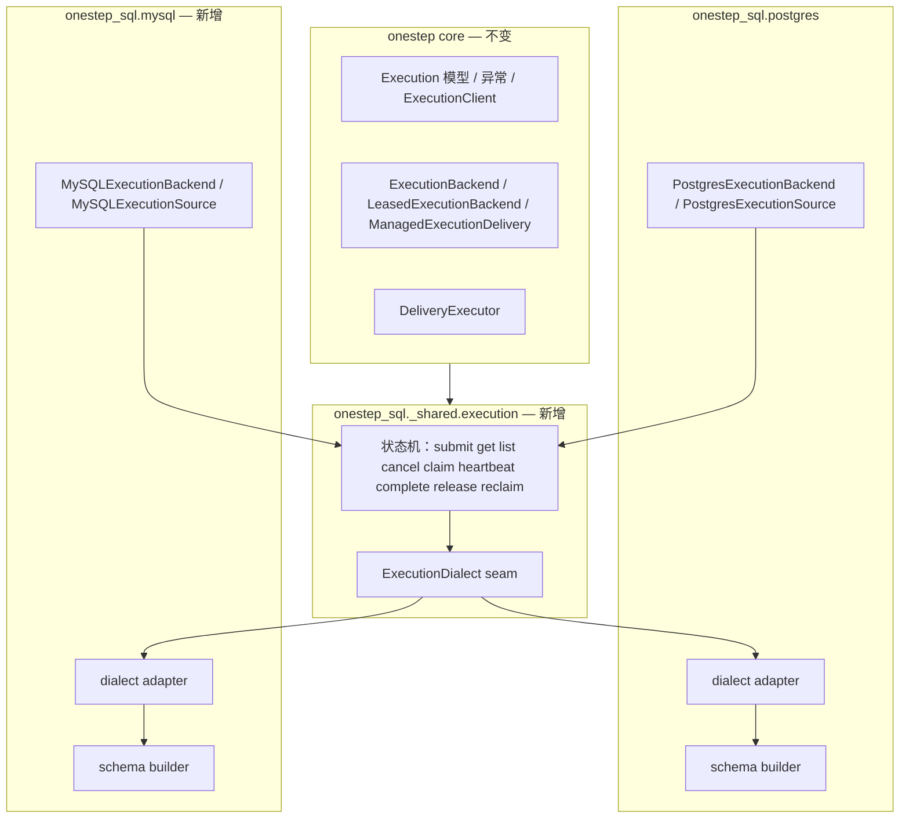

# MySQL Tracked Execution Backend 设计

日期：2026-09-15
状态：draft design contract（待 captain 评审）
范围：规划与设计。本文档本身不修改任何运行时代码、发布包或既有已合并 PR。
上游设计：`docs/superpowers/specs/2026-08-09-postgres-execution-backend-design.md`（tracked execution 的原始设计，§3.1 已为多 backend 预留 core 协议边界；该文档与 §4 引用的部分站点页面目前只在 `docs` 分支，见 §4.3）

## 1. 决策摘要

core 的 tracked execution 协议层（`ExecutionBackend` / `LeasedExecutionBackend` / `ManagedExecutionDelivery` / `ExecutionClient`）从设计之初就是 backend 中立的，PostgreSQL 实现里只有约 3 处方言分支。本设计把该能力扩展到 MySQL 8.0，新增 `MySQLExecutionBackend` / `MySQLExecutionSource` 与 `mysql_execution_source` YAML type。

结论：**可行，无阻塞项。** 已用未修改的 `PostgresExecutionBackend` / `PostgresExecutionSource` 在 MySQL 8.0.46 上完成端到端实证（§5），全部状态机路径与并发不变量通过。需要的是一组有界的方言适配（§6），集中在 schema builder、engine/session 配置与时间归一化三处，不触及 core。

必须同时做的前置修订：`docs/superpowers/specs/2026-08-20-onestep-sql-consolidation-design.md` §11 与 `2026-08-20-onestep-sql-execution-tasks.md` §0 当前把 tracked execution 钉死为 PostgreSQL-only（原文见 §4.1）。这是本设计要显式取代的边界，必须随本设计一并修订，而不是绕过。

## 2. 背景与问题定义

### 2.1 现状

PostgreSQL tracked execution 已上线并被文档化为“长任务提交 / 查询 / 结果 / 取消 / 租约”能力（`docs/broker/postgres-execution.md`）。它解决的是：HTTP 请求提交一个长任务并立刻拿到稳定 ID，业务侧再按 ID 查询状态与结果，worker 崩溃后租约可恢复。

它的实现分层是：

| 层 | 位置 | 是否 backend 中立 |
| --- | --- | --- |
| 协议、模型、异常、客户端 | `src/onestep/execution.py` | 是（0 处 postgres 引用） |
| runtime 接入 | `src/onestep/runtime/executor.py`（`_managed_delivery` / `_complete_managed_execution`） | 是（按 `isinstance(delivery, ManagedExecutionDelivery)` 结构化路由） |
| 状态机实现 | `plugins/onestep-sql/src/onestep_sql/postgres/execution_backend.py` | 几乎（3 处方言分支） |
| schema | `.../postgres/execution_schema.py` | 否（方言默认值、部分索引、标识符长度） |

已验证 core 侧确实无耦合：

```text
$ grep -rn "postgres\|psycopg\|asyncmy" src/onestep/execution.py src/onestep/runtime/executor.py
（无输出）
```

### 2.2 问题

只用 MySQL 的技术栈无法使用该能力。业务方要么退回 `mysql_table_queue` 自行实现状态机、租约、幂等、结果与分页（正是上游设计 §2 判定“不应由每个业务重复实现”的那部分），要么额外引入一个 PostgreSQL 实例。

上游设计 §3.1 明确写下目标：“为未来的其它 backend 或『消息 broker + result store』组合保留 core 协议边界”。本设计是该目标在 SQL 家族内的第一次兑现。

### 2.3 为什么是 MySQL 而不是 Redis / RabbitMQ / SQS

MySQL 与 PostgreSQL 共享同一套实现模型：事务内 CAS + `FOR UPDATE SKIP LOCKED` + 索引化 keyset 分页。因此它是**移植**问题，而不是新实现问题。

Redis / RabbitMQ / SQS / Kafka 缺少「事务性 CAS + 可索引 `list()` 分页」这两点：`ExecutionClient.list()` 的游标分页、幂等提交、`version` 单调递增在 broker 语义里没有自然对应物，必须引入 broker + result store 的双写协议（Outbox 或显式提交协议）。上游设计 §4 已把这条路径显式推迟（“这不是 PostgreSQL 首期的前置条件”），本设计同样不进入该范围。

## 3. 目标与非目标

### 3.1 目标

- 让 MySQL 8.0 成为 tracked execution 的第二个 backend，语义与 PostgreSQL 版**逐条对齐**。
- 复用同一份状态机实现，避免 1100 行级别的复制实现（与 `_shared` 的既有原则冲突）。
- `postgres_execution_source`、`PostgresExecutionBackend`、`PostgresExecutionSource` 的行为、公开签名与导入路径零变化。
- 新增 `mysql_execution_source` YAML type 与 `MySQLConnector.execution_backend()`。
- 明确并记录 MySQL 与 PostgreSQL 的语义差异（时间精度、隔离级别、约束命名、部分索引），避免“看起来一样、实际不同”的静默偏差。
- 让 MySQL 路径进入仓库统一 live 集成脚本与 CI，而不是只在本机手工验证。

### 3.2 非目标

- 不实现 broker + result store 组合 backend（Redis / RabbitMQ / SQS / Kafka），理由见 §2.3。
- 不把 MySQL 做成 binlog 以外的 CDC 或 logical replication。
- 不改变 core 协议：不改 `Delivery.ack/retry/fail` 签名，不给 `Envelope` 增加必填字段，不改 TaskEvent kind。
- 不改变 20 个既有 YAML type 名、catalog role、allowed fields、defaults 或 connector boundaries。
- 不为 MySQL 引入“强制终止任务”或 exactly-once 承诺；取消仍是协作式的。
- 不删除或弱化 `postgres_execution_source`；两个 backend 并存。
- 不做跨 backend 的 execution 表读写（一个 execution 表只属于一个 backend）。

## 4. 既有约束与需要修订的文档

### 4.1 与现状冲突的钉子

以下位置当前把 tracked execution 钉为 PostgreSQL-only，与本设计直接冲突，必须一并修订：

| 位置 | 当前文字 | 处置 |
| --- | --- | --- |
| `docs/superpowers/specs/2026-08-20-onestep-sql-consolidation-design.md` §11 验收标准 | “`mysql_binlog` 始终是 MySQL 特有；`postgres_execution_source` 和 tracked execution 始终是 PostgreSQL 特有” | 改为“`mysql_binlog` 始终是 MySQL 特有；`postgres_execution_source` 始终是 PostgreSQL 特有，`mysql_execution_source` 始终是 MySQL 特有；tracked execution 由两个 backend 各自实现，不跨 backend 混用” |
| `docs/superpowers/specs/2026-08-20-onestep-sql-execution-tasks.md` §0 | “PostgreSQL tracked execution（…）始终 PostgreSQL-only” | 同上口径 |
| `plugins/onestep-sql/README.md` “What is NOT changing” | “`postgres_execution_source` / tracked execution stays PostgreSQL-only” | 改为“每个 backend 的 execution source 只接受该 backend 的 connector” |
| `docs/guide/migrate-to-onestep-sql.md`、`docs/en/guide/migrate-to-onestep-sql.md`（en 版目前仅在 `docs` 分支，见 §4.3） | “tracked execution 始终是 PostgreSQL 专属（依赖 PostgreSQL 事务/锁/lease 语义）” | 改为按 backend 说明；删除“只有 PostgreSQL 才有该能力”的暗示 |
| `AGENTS.md` onestep-sql 小节 | “…binlog (mysql) and tracked execution (postgres)” | 改为 “binlog (mysql) and tracked execution (postgres + mysql)” |

关键点：修订后 **仍然** 保留两条真实边界——`mysql_binlog` 只属于 MySQL；`postgres_execution_source` 只属于 PostgreSQL。新增的只是 `mysql_execution_source` 属于 MySQL。consolidation 设计 §4.1 的“14 个现有 type 名全部保留”验收标准依然满足（现有 type 名一个不动，只新增）。

### 4.2 仍然有效的既有边界

- `onestep_sql._shared` 不是 public API，且只能容纳两端语义已经一致、参数/错误/at-least-once contract 相同的代码（consolidation 设计 §3.1）。
- 不使用 `SQLConnector` / `TableSource` 这类 generic public class 取代 backend 命名 API。新 API 必须叫 `MySQLExecutionBackend` / `MySQLExecutionSource`。
- `postgres/execution_backend.py`、`execution_schema.py`、`execution_source.py` 是已发布的 submodule 导入路径，兼容窗口内必须保持可导入且指向同一对象（consolidation 设计 §5.2 第 3 条）。

### 4.3 分支说明（写作时的仓库状态）

本设计写作时仓库处于 `main`（`2c66699`，1.12.0）。`docs` 分支严格领先 `main` 45 个提交（`main` 是 `docs` 的祖先），且两个分支上 `plugins/onestep-sql/src/`、`src/onestep/execution.py`、`src/onestep/runtime/executor.py` **逐字节相同**——本设计的技术结论与代码引用在两条分支上都成立。只有下列文档路径是分支相关的：

| 路径 | 在 `main` | 在 `docs` | 处置 |
| --- | --- | --- | --- |
| `docs/superpowers/specs/2026-08-09-postgres-execution-backend-design.md` | 不存在 | 存在 | 本文档的"上游设计"引用；在 `docs` 上生效。若要在 `main` 上引用它，需先把它带回 `main`，或改引 `docs/broker/postgres-execution.md` |
| `docs/broker/sql.md` | 不存在（`main` 是 `mysql.md` + `postgres.md` 两页） | 存在（合并为 SQL 一页） | §13 Phase 4 的文档落点二选一，按目标分支取用 |
| `docs/en/guide/migrate-to-onestep-sql.md` | 不存在 | 存在 | §4.1 的修订清单在 `docs` 上生效；`main` 上只有 zh 版 |
| `docs/guide/cases/` | 不存在 | 存在 | 同上，Phase 4 的案例补写只在 `docs` 上生效 |

§4.1 表格的其余各行（consolidation 设计 §11、execution-tasks §0、`plugins/onestep-sql/README.md`、`AGENTS.md`，以及 `docs/guide/migrate-to-onestep-sql.md` 的 zh 版）在两条分支上都存在，均需修订。

## 5. 可行性证据（MySQL 8.0.46 实测）

本节所有结论来自把**未修改的** `PostgresExecutionBackend` / `PostgresExecutionSource` 直接跑在 MySQL 8.0.46 上，仅替换 schema builder 中的方言差异（§6.1/§6.2）。环境：`mysql:8.0.46`、默认 `REPEATABLE-READ`、`utf8mb4`、InnoDB。

### 5.1 状态机逐条对齐

| 路径 | 结果 |
| --- | --- |
| `submit` → `get`（payload/metadata round-trip） | 通过 |
| 幂等重放（同 key 同 payload 返回同一条） | 通过 |
| 幂等冲突（同 key 不同 payload → `ExecutionConflict`） | 通过 |
| `list` keyset 分页（两页无重叠） | 通过 |
| `claim` + 租约（`running`、`attempts=1`） | 通过 |
| `heartbeat`（`cancel_requested=False`、续租） | 通过 |
| `complete(SUCCEEDED)` + result 持久化 | 通过 |
| 终态重放（相同 result 幂等接受 / 不同 result 拒绝） | 通过 |
| 过期 token 的 heartbeat 被拒（`StaleExecutionLease`） | 通过 |
| `release` 回到 `queued` | 通过 |
| `cancel` queued → `cancelled` | 通过 |
| `cancel` running → `cancel_requested`，heartbeat 上报 | 通过 |
| 取消优先于迟到的 success（收敛为 `cancelled`） | 通过 |
| 租约过期回收（新 worker 接管，`attempts=2`） | 通过 |
| 僵尸 worker 完成被 fence（`StaleExecutionLease`） | 通过 |
| `retrying` 完成 + `available_at` | 通过 |
| `failed` 完成 + `ExecutionError` | 通过 |
| `expires_at` 到期行不被 claim，转 `expired` | 通过 |

### 5.2 Source / Delivery 层

`fetch`（信封 + `onestep.execution` correlation meta）、`start_processing`（心跳 task 启动）、`complete_execution`、`release_unstarted`、心跳观察到 cancel 并取消 owner task、`retry`、`fail`：全部通过。

### 5.3 runtime 层

`OneStepApp` + `TaskRunner._handle_delivery` 的 cancel/success 竞态收敛为 `cancelled`（`result=None`）；端到端两次任务执行返回正确结果。

### 5.4 并发不变量

| 场景 | 结果 |
| --- | --- |
| 8 worker × 300 行并发 claim（`SKIP LOCKED`） | 300 claimed / 300 unique / 0 重复 / 0 死锁 / 0 锁等待超时 |
| 10 worker × 200 行，`READ COMMITTED` | 200 unique / 0 重复 |
| 租约回收 vs 旧 worker 完成竞态 × 40 轮 | reclaimed=40 / old_fenced=40 / zombie_won=0 |
| 并发幂等 submit（8 路） | inserted=1 / integrity_errors=7（正确） |
| 6 engine 并发 `auto_create`（加 `GET_LOCK`） | 0 错误 |

### 5.5 两个必须知道的前提

- **`rowcount` 语义可用。** SQLAlchemy 的 mysql dialect 会设置 `CLIENT.FOUND_ROWS`（`sqlalchemy/dialects/mysql/asyncmy.py`），因此 `rowcount` 返回**匹配**行数而非**改变**行数。backend 的 CAS 模式（`UPDATE ... WHERE id=? AND lease_token=? AND status IN (...)` 后判断 `rowcount != 1`）因此在 MySQL 上成立。已在三种隔离级别下实测：同值 CAS=1、错 token CAS=0。
- **CHECK 约束在 MySQL 8.0 是被强制执行的**（违反时报 3819），前提是 8.0.16+。低于该版本 CHECK 只解析不执行，会静默降级。

## 6. 方言差异与必须的适配

以下每一条都是实测得到的具体差异，不是推测。集中在三处：schema builder、engine/session 配置、时间归一化。

### 6.1 JSON 列默认值

PostgreSQL 使用字面量默认值：

```sql
metadata JSONB NOT NULL DEFAULT '{}'
```

MySQL 直接拒绝：

```text
(1101, "BLOB, TEXT, GEOMETRY or JSON column 'metadata' can't have a default value")
```

MySQL 8.0.13+ 要求表达式默认值：`DEFAULT (JSON_OBJECT())`。

**实现陷阱（已实测）：** 不能在表构造完成后再改 `column.server_default`。赋值 `sa.text("(JSON_OBJECT())")` 会让编译出的 DDL 变成 `metadata JSON NOT NULL`——**默认值整个消失**，随后任何不显式绑定 metadata 的 INSERT 会报 1364。必须二选一：

- 在 `sa.Column(...)` 构造时就传入正确的 `server_default`；或
- 后置赋值时包成 `sa.DefaultClause(sa.text("(JSON_OBJECT())"))`（实测可正确渲染）。

推荐前者：schema builder 按 dialect 参数在构造期选择默认值表达式。

### 6.2 DATETIME 精度与四舍五入

MySQL `DATETIME` 默认 `fsp=0`，且**四舍五入**而不是截断：

| 输入 | `DATETIME(0)` | `DATETIME(6)` |
| --- | --- | --- |
| `02:00:00.7` | `02:00:01` ← 进位 | `02:00:00.700000` |
| `02:00:00.4` | `02:00:00` | `02:00:00.400000` |
| `02:00:00.999999` | `02:00:01` ← 进位 | `02:00:00.999999` |

后果是**真实的 claim 失败**：`available_at` 被进位到下一秒后，claim 的 `available_at <= now` 立刻不成立，刚提交的任务短暂不可领取。第一轮 parity 测试就是这样卡在 `claim` 返回 0 条。

所有时间列必须显式 `DATETIME(6)`。PostgreSQL 的 `TIMESTAMPTZ` 天然保留微秒，无此问题。

### 6.3 时区语义与 offset 丢弃（正确性问题）

MySQL `DATETIME` 无时区信息，驱动**直接丢弃 offset 而不做转换**：

```text
绑定 2026-09-15T12:27:26+08:00  →  存储 2026-09-15 12:27:26
读回（backend 按 UTC 解释）      →  2026-09-15T12:27:26+00:00   ← 错了 8 小时
```

用真实 backend 复现的后果：一个 `expires_at` 设在 +08:00 且**已经过期**的任务，被错误地判为未过期并被正常 claim 成 `running`。

PostgreSQL 的 `TIMESTAMPTZ` 会归一到 UTC，所以该 bug 只在 MySQL 出现。

处置：在写入边界把值强制归一为 UTC。`ExecutionRequest.expires_at` 是唯一由调用方直接传入的时间，必须在 `_submit` 绑定前 `.astimezone(timezone.utc)`；其余时间来自内部 `_now()`（已是 UTC）。读取路径已有 `_aware_utc()` 补 tzinfo，无需改动。同时必须验证 `expires_at` 的 tz-aware 前置条件，拒绝 naive datetime 而不是猜测。

### 6.4 会话时区必须钉住 UTC

MySQL 的 `CURRENT_TIMESTAMP` / `NOW()` 跟随 `@@session.time_zone`（实测：`CURRENT_TIMESTAMP` 返回 `10:45` 而 `UTC_TIMESTAMP` 返回 `02:45`）。连接建立时必须把 session tz 固定为 UTC，否则任何走数据库时钟的路径都会漂移。

注意与下一条的相互作用。

### 6.5 事务内时间不稳定（不要“优化”成 NOW()）

PostgreSQL 的 `transaction_timestamp()` 在事务内稳定；MySQL 的 `NOW(6)` / `CURRENT_TIMESTAMP(6)` **不稳定**：

```text
同一事务内两次 NOW(6)：03:31:44.101726 -> 03:31:44.353719  （stable: False）
```

`PostgresExecutionBackend._transaction_now()` 对 postgres 走 `current_timestamp()`，否则回退到注入时钟。MySQL **必须继续走注入时钟分支**，不得为了“一致性”改用 `NOW()`：claim 事务内的过期清理、租约计算、CAS 谓词都假设同一个 `now`。

### 6.6 CHECK 约束名是 schema 级全局的

PostgreSQL 的约束名按表作用域；MySQL 是 schema 全局：

```text
(3822, "Duplicate check constraint name 'ck_onestep_execution_status'.")
```

后果：同一个库里**第二组 execution 表建不出来**。这不仅是多 namespace 场景——PostgreSQL live 测试覆盖的“共享 executions 表 + 两个不同 attempts 表”用法也会撞（`ck_onestep_attempt_status` 冲突）。

现有 `_postgres_object_name()` 已经对 index/unique 名做了按表名派生 + 超长截断哈希，但两个 CheckConstraint 用的是**硬编码常量名**。MySQL 适配必须让 CHECK 名也按表名派生。

### 6.7 部分索引被静默忽略

PostgreSQL 与 SQLite 支持 `WHERE` 部分索引；MySQL 不支持，且 SQLAlchemy **不报错、静默丢弃**谓词：

```text
postgresql: CREATE INDEX ix_..._claim ON ... WHERE status IN ('queued', 'retrying')
mysql:      CREATE INDEX ix_..._claim ON ...            ← WHERE 消失
```

两个后果：

1. 索引变为全表索引，功能正确但体积与写放大更大。MySQL 8.0 没有部分索引替代品，接受该差异并记录。
2. 唯一索引 `uq_..._idempotency (namespace, task_name, idempotency_key)` 失去 `WHERE idempotency_key IS NOT NULL` 谓词。**这仍然正确**：MySQL 的 UNIQUE 允许多个 NULL（已实测：3 行 NULL 共存；重复非 NULL 被 1062 拒绝）。因此幂等语义不变，但这一点必须在测试中显式锁定，不能靠假设。

### 6.8 并发 auto_create 需要换锁原语

`execution_backend.py` 的 `_ensure_ready_locked()` 在 `dialect.name == "postgresql"` 时用 `pg_advisory_xact_lock` 串行化建表。MySQL 没有该函数，走 else 分支后 6 个 backend 并发建表 **6/6 失败**：

```text
(1050, "Table 'conc_executions' already exists")
```

MySQL 等价物是 `GET_LOCK()`（会话级命名锁，实测可正确串行化：持有时第二个连接返回 0，释放后返回 1；6 engine 并发建表 0 错误）。

两个限制：

- 锁名上限 **64 字符**（65 报 4163）。`GET_LOCK` 名字要取哈希截断，不要直接用表名拼接。
- `GET_LOCK` 是**会话级**而非事务级，`RELEASE_LOCK` 必须放在 `finally`，否则连接归还连接池后锁仍然被占用（实测：未释放时 `IS_USED_LOCK` 仍返回持有者线程 id）。DDL 在 MySQL 里会隐式提交（实测：`CREATE TABLE` 后 `ROLLBACK` 不回滚），所以不能用事务回滚来兜底释放。

### 6.9 标识符与索引长度

| 项 | 上限 | 说明 |
| --- | --- | --- |
| 表名 / 索引名 | 64（实测 64 OK，65 报 1059） | 比 PostgreSQL 的 63 略宽 |
| `GET_LOCK` 名 | 64 | 见 §6.8 |
| utf8mb4 索引键前缀 | 3072 字节（DYNAMIC 行格式） | `3 × VARCHAR(255) × 4 = 3060` 字节，实测可建 |

现有 `_POSTGRES_IDENTIFIER_MAX_LENGTH = 63` 与 `_postgres_object_name()` 的截断逻辑对 MySQL 同样安全（更保守），可复用；但函数命名与常量要按 backend 语义重命名或参数化，避免把 “postgres” 写进 MySQL 路径。

### 6.10 隔离级别

MySQL 默认 `REPEATABLE-READ`。claim 在**空匹配区间**上取 `FOR UPDATE SKIP LOCKED` 时会产生 gap lock，实测阻塞并发 INSERT：

| 隔离级别 | 空区间 claim 期间并发 INSERT |
| --- | --- |
| `REPEATABLE READ`（默认） | 阻塞 1000ms+，直到持锁事务结束 |
| `READ COMMITTED` | 16ms，未被阻塞 |

同时 RR 的语句级快照会在长事务中放大过期清理与回收的可见性问题。

**处置：MySQL engine 必须显式使用 `READ COMMITTED`**（`create_async_engine(..., isolation_level="READ COMMITTED")`，实测对连接池内所有连接稳定生效）。这是可用性要求（避免提交路径被 claim 阻塞）而非已证实的正确性缺陷——在 RR 下顺序与并发 parity 也全部通过——但显式设定是防止未来长事务把该风险放大的必要防线。

## 7. 架构与模块归属

### 7.1 分层



### 7.2 抽取原则

PostgreSQL 实现约 1150 行，其中只有 §6.1–§6.9 列出的方言差异。直接复制成 MySQL 版会产生约 1100 行近乎重复的实现，与 consolidation 设计“没有未解释的复制实现”的退出门槛直接冲突。

因此采用**抽取 + 方言接缝**：

- `onestep_sql/_shared/execution/` 承载状态机（提交、幂等、分页、取消、claim、心跳、完成、回收、fencing）。
- 每个 backend 只提供 `ExecutionDialect` 实现与 schema builder。
- `PostgresExecutionBackend` / `PostgresExecutionSource` 保留原名、原导入路径、原签名，成为薄子类。

`_shared` 的准入条件（consolidation §3.1）在此满足：两端的状态机参数、错误类型与 at-least-once contract 完全一致，差异**只**在 §6 的方言清单内。§6 同时证明 schema 层**不能**进 `_shared`——那正是两端语义不同的地方。

### 7.3 方言接缝的建议形态

```python
class ExecutionDialect(Protocol):
    name: str

    def build_tables(
        self, *, executions_table: str, attempts_table: str
    ) -> ExecutionTables: ...

    def transaction_now(self, conn: Any) -> datetime | None:
        """Return a DB-derived 'now', or None to use the injected clock.

        PostgreSQL returns current_timestamp(); MySQL returns None because
        NOW() is not transaction-stable (see §6.5).
        """

    def normalize_datetime(self, value: datetime) -> datetime:
        """Normalize a caller-supplied datetime before binding (see §6.3)."""

    async def create_tables(self, engine: Any, tables: list[Any]) -> None:
        """Create tables with backend-appropriate serialization (see §6.8)."""
```

接缝必须保持最小：**不要**把方言差异做成通用的 `_build_statement` 分支树。MySQL 与 PostgreSQL 的 SQL 在这套状态机里是同构的（同样的 `UPDATE ... WHERE ...` CAS、同样的 `FOR UPDATE SKIP LOCKED`、同样的 keyset 分页），差异只在上面这几项。

### 7.4 模块与导入路径

```text
plugins/onestep-sql/src/onestep_sql/
  _shared/
    execution/                 # 新增：状态机 + ExecutionDialect 协议
      __init__.py
      machine.py               # submit/get/list/cancel/claim/heartbeat/complete/release/reclaim
      dialect.py               # ExecutionDialect 协议 + 共享 helper（_aware_utc 等）
  postgres/
    execution_schema.py        # 保留：PG schema（CHECK 名按表派生以与 MySQL 对齐或保持现状）
    execution_backend.py       # 保留：PostgresExecutionBackend 薄子类 + 再导出 StaleExecutionLease
    execution_source.py        # 保留：PostgresExecutionSource / PostgresExecutionDelivery
  mysql/
    execution_schema.py        # 新增：MySQL schema builder（§8）
    execution_backend.py       # 新增：MySQLExecutionBackend
    execution_source.py        # 新增：MySQLExecutionSource / MySQLExecutionDelivery
```

约束：

- `onestep_sql.postgres.execution_backend` 等三个 submodule 路径必须继续可导入且对象 identity 不变（兼容窗口要求）。
- `_shared.execution` 不是 public API；`MySQLExecutionBackend` 的实际定义可以在 `_shared` 中，但必须以明确的 backend alias 暴露在 `onestep_sql.mysql`。
- `MySQLExecutionBackend` / `MySQLExecutionSource` / `MySQLExecutionDelivery` 命名必须 backend 化，不使用 generic 名。

## 8. MySQL 数据模型

表名可配置，默认沿用与 PostgreSQL 相同的默认名以降低认知成本（`onestep_executions` / `onestep_execution_attempts`）。列定义与 PostgreSQL 版逐列一致，仅类型与约束按本节调整。

### 8.1 类型映射

| 逻辑类型 | PostgreSQL | MySQL |
| --- | --- | --- |
| JSON | `JSONB` | `JSON` |
| UUID | `UUID` | `CHAR(32)`（SQLAlchemy `sa.Uuid`，实测往返正确） |
| 时间 | `TIMESTAMPTZ` | `DATETIME(6)`（**必须 fsp=6**，§6.2） |
| 整数 | `INTEGER` / `BIGINT` | 同 |
| 字符串 | `VARCHAR(n)` | `VARCHAR(n)`，表 `CHARSET=utf8mb4` |

### 8.2 DDL 差异

相对 PostgreSQL 版（`docs/superpowers/specs/2026-08-09-postgres-execution-backend-design.md` §11，见 §4.3 的分支说明）只有四处：

```sql
-- 1) JSON 默认值改为表达式（§6.1）
metadata JSON NOT NULL DEFAULT (JSON_OBJECT()),

-- 2) 时间列全部显式 fsp=6（§6.2）
available_at DATETIME(6) NOT NULL,
lease_expires_at DATETIME(6),
created_at DATETIME(6) NOT NULL,
-- ... 其余时间列同理

-- 3) CHECK 约束名按表名派生（§6.6）
CONSTRAINT ck_onestep_execution_status_<table> CHECK (...),

-- 4) 索引去掉 WHERE 谓词（§6.7）——MySQL 无部分索引
CREATE UNIQUE INDEX uq_onestep_execution_idempotency
  ON onestep_executions (namespace, task_name, idempotency_key);
CREATE INDEX ix_onestep_execution_claim
  ON onestep_executions (namespace, task_name, available_at, created_at, id);
CREATE INDEX ix_onestep_execution_lease
  ON onestep_executions (lease_expires_at, id);
```

表选项：`ENGINE=InnoDB DEFAULT CHARSET=utf8mb4`。InnoDB 是行级锁与 `SKIP LOCKED` 的前提。

外键 `attempts.execution_id → executions.id ON DELETE CASCADE` 保持不变（InnoDB 支持）。

### 8.3 最低版本要求

| 要求 | 版本 | 原因 |
| --- | --- | --- |
| MySQL | **8.0** | `FOR UPDATE SKIP LOCKED` |
| MySQL | **8.0.13+** | JSON 表达式默认值（§6.1） |
| MySQL | **8.0.16+** | CHECK 约束真正强制执行（§5.5） |

综合下限：**MySQL 8.0.16**。低于此版本必须在 `open()` 时明确报错，而不是静默降级（例如 CHECK 被忽略后状态机失去最后一道防线）。MySQL 5.7 不支持 `SKIP LOCKED`，必须直接拒绝。

## 9. 并发、时间与隔离语义

### 9.1 与 PostgreSQL 一致的部分

- claim 使用 `SELECT ... FOR UPDATE SKIP LOCKED`，排序 `(available_at, created_at, id)`，批量上限可配。
- 完成 / 重试 / 失败 / 取消确认使用同一 CAS 形式：`WHERE id = ? AND lease_token = ? AND status IN (...)`。
- `rowcount != 1` 时回读当前状态，区分“幂等重放”（相同业务结果，接受）与“租约失效”（`StaleExecutionLease`，拒绝）。
- `version` 每次状态迁移递增；fencing 的权威条件仍是 `execution_id + status + lease_token`。
- 租约过期的 `running` 行可被同一 claim 事务接管，旧 attempt 标 `lease_lost`，新 attempt 用新 token。

### 9.2 与 PostgreSQL 不同的部分

| 维度 | PostgreSQL | MySQL | 影响 |
| --- | --- | --- | --- |
| 隔离级别 | 默认（`READ COMMITTED`） | 必须显式 `READ COMMITTED` | §6.10 |
| 事务内时间 | `transaction_timestamp()` 稳定 | `NOW()` 不稳定 → 用注入时钟 | §6.5 |
| 时间精度 | 微秒原生 | 必须 `DATETIME(6)` | §6.2 |
| offset 处理 | 归一到 UTC | 丢弃 offset → 必须显式归一 | §6.3 |
| 部分索引 | 支持 | 不支持，静默全量 | §6.7 |
| 约束名作用域 | 表级 | schema 级 | §6.6 |
| 建表并发锁 | `pg_advisory_xact_lock` | `GET_LOCK` + `finally` 释放 | §6.8 |

### 9.3 会话时区

连接建立时钉住 UTC（§6.4）。实现方式（择一，实施时验证）：

- 在 engine 的 connect 事件里执行 `SET time_zone = '+00:00'`；或
- 只用注入时钟与 UTC 归一后的参数，完全不依赖数据库时钟函数。

推荐**两者都做**：即使当前代码路径不依赖数据库时钟，把 session tz 钉住可以防止未来新增查询时引入隐蔽漂移。

## 10. 公开 API

### 10.1 Python

```python
from onestep import ExecutionClient
from onestep_sql.mysql import MySQLConnector

mysql = MySQLConnector("mysql+asyncmy://app:secret@db/app")
backend = mysql.execution_backend(
    table="onestep_executions",
    attempts_table="onestep_execution_attempts",
    auto_create=True,
)
step = ExecutionClient(backend, namespace="agent-api")
```

worker 侧：

```python
from onestep import ExponentialBackoff, OneStepApp
from onestep_sql.mysql import MySQLConnector

app = OneStepApp("agent-api")
mysql = MySQLConnector("mysql+asyncmy://app:secret@db/app")
backend = mysql.execution_backend(auto_create=True)
jobs = backend.source(
    namespace="agent-api",
    task_names=("run_agent",),
    batch_size=4,
    poll_interval_s=0.5,
    lease_duration_s=90,
    heartbeat_interval_s=30,
    worker_id="agent-worker-1",
)
app.register_resource("mysql", mysql)
```

`MySQLConnector.execution_backend()` 的签名与 `PostgresConnector.execution_backend()` 逐参数对齐（`table` / `attempts_table` / `auto_create` / `max_payload_bytes` / `max_metadata_bytes` / `max_result_bytes` / `reclaim_batch_size`）。两个 backend 的 `source(...)` 参数集也保持对齐。

### 10.2 YAML

```yaml
resources:
  mysql_db:
    type: mysql
    dsn: "${MYSQL_DSN}"

  agent_jobs:
    type: mysql_execution_source
    connector: mysql_db
    namespace: agent-api
    task_names: [run_agent]
    table: onestep_executions
    attempts_table: onestep_execution_attempts
    batch_size: 4
    poll_interval_s: 0.5
    lease_duration_s: 90
    heartbeat_interval_s: 30
    worker_id: "${HOSTNAME:-agent-worker}"
    auto_create: true

tasks:
  - name: run_agent
    source: agent_jobs
    handler:
      ref: agent_worker.tasks:run_agent
    concurrency: 4
    retry:
      type: exponential_backoff
      max_attempts: 3
      min_delay_s: 2
      max_delay_s: 30
    timeout_s: 1800
```

`mysql_execution_source` 的 strict validation 与 `postgres_execution_source` 同构：namespace 非空且 ≤255；`task_names` 恰好一个；`batch_size ≥ 1`；`heartbeat_interval_s ≤ lease_duration_s / 3`；connector 必须是 MySQL connector（跨 backend 传 connector 必须报错，沿用 consolidation §6 的“不提供 generic connector”原则）。

### 10.3 不变的契约

core 的 `ExecutionClient` / `Execution` / `ExecutionStatus` / 异常类型对两个 backend 完全相同。业务代码在换 backend 时不需要改，只改构造 backend 的那一行。`result()` 仍不轮询、不等待。

## 11. 测试策略

### 11.1 单元与契约（无数据库）

- MySQL schema builder：类型映射、`DATETIME(6)`、JSON 表达式默认值、CHECK 名按表派生、无 `WHERE` 索引。
- 方言接缝：`transaction_now` 对 MySQL 返回 `None`；`normalize_datetime` 把 +08:00 归一为 UTC。
- `MySQLConnector.execution_backend()` 参数校验与默认值。
- `mysql_execution_source` strict YAML catalog 快照（type、role、allowed fields、defaults、connector type）。
- **回归红线**：抽取 `_shared.execution` 后，现有 PostgreSQL 全套单测（`test_postgres_execution_backend.py`、`test_postgres_execution_source.py`、`test_execution_schema.py`，当前 **59** 个用例，多数跑在 `sqlite:///` 上）必须**零修改通过**。这是抽取不改变语义的主要证据。
- `tests/contract/test_onestep_sql_canonical.py` 的 type 集合断言更新为 21 个 type，并新增断言：`mysql_execution_source` 只接受 MySQL connector、`postgres_execution_source` 只接受 PostgreSQL connector。

### 11.2 MySQL live 集成（新增）

镜像 `plugins/onestep-postgres/tests/integration/test_postgres_execution_live.py` 的结构：

- 多 backend 实例并发 `SKIP LOCKED` 领取不重复。
- worker A 租约过期后 worker B 接管；A 的旧 token 不能写成功。
- heartbeat 防止未过期任务被接管。
- cancel 与 complete 并发下只有一个合法终态。
- 并发幂等 submit 只生成一条记录。
- **MySQL 专属**：并发 `auto_create`（多 engine）不报 1050。
- **MySQL 专属**：同库两组 execution 表可共存（§6.6 回归）。
- **MySQL 专属**：共享 executions 表 + 两个 attempts 表可共存（PG live 已有同款用例）。
- **MySQL 专属**：非 UTC `expires_at` 归一（§6.3 回归）。
- **MySQL 专属**：`DATETIME(6)` 保精度，claim 不被进位延迟（§6.2 回归）。
- **MySQL 专属**：隔离级别为 `READ COMMITTED` 的断言。

### 11.3 基础设施

- `docker-compose.integration.yml` 已有 `mysql:8.4` 服务（含 binlog ROW 配置）与 `postgres:16-alpine`；execution 测试复用现有 MySQL 服务即可，不需要新服务。注意 MySQL 8.4 与 8.0 的差异需要在 CI 中至少覆盖一个 8.0 版本，因为 8.4 已移除部分旧默认行为。
- `scripts/run-integration-tests.sh` 加入 MySQL execution live 目录。
- `.github/workflows/plugin-sql.yml` 增加 MySQL live job，并把 `tests/contract/test_onestep_sql_canonical.py` / `test_onestep_sql_shared.py` 之外的 MySQL execution 套件纳入。

### 11.4 不能只依赖 SQLite

上游设计 §15.2 已写明“PostgreSQL 并发集成测试，不能只依赖 SQLite”。该结论对 MySQL 同样成立，且理由更强：SQLite 没有 `FOR UPDATE SKIP LOCKED`、没有 gap lock、没有 schema 级约束名——§6.6 与 §6.10 两类缺陷在 SQLite 上**完全不可见**。

## 12. 代码破坏性分析

### 12.1 低风险增量

| 变更 | 风险 | 原因 |
| --- | --- | --- |
| 新增 `mysql_execution_source` YAML type | 低 | 纯新增 type，不动既有 20 个 |
| 新增 `MySQLConnector.execution_backend()` | 低 | 现有方法与表不变 |
| 新增 `MySQLExecutionBackend` / `MySQLExecutionSource` | 低 | 新符号，旧应用不引用 |
| MySQL execution 表 | 低 | 独立命名空间，不迁移业务表与 state 表 |

### 12.2 中等回归风险

| 变更 | 风险 | 控制方式 |
| --- | --- | --- |
| 抽取 `_shared.execution` 状态机 | **中高** | PostgreSQL 全套单测 + live 套件零修改通过；分两步提交（先抽取后加 MySQL） |
| `PostgresExecutionBackend` 变薄子类 | 中 | 保持公开签名、导入路径、异常 identity；`StaleExecutionLease` 再导出 |
| MySQL 时间归一改动 | 中 | §6.3 的专项回归用例 |
| 建表锁原语替换 | 中 | 并发 `auto_create` live 用例 |

### 12.3 明确拒绝的破坏性变更

- 不把 `_shared.execution` 暴露为 public API。
- 不重命名 `postgres_execution_source` 或任何既有 YAML type。
- 不删除 `onestep_sql.postgres.execution_*` 三个 submodule 路径。
- 不把两个 backend 合并成 generic `SQLExecutionBackend`。
- 不改变 core 的 `ExecutionBackend` / `ManagedExecutionDelivery` 协议形状。
- 不为了复用而让 MySQL 依赖 psycopg，或让 PostgreSQL 依赖 asyncmy。

## 13. 分阶段交付

### Phase 0：边界修订与基线

- 修订 §4.1 列出的五处文档与 AGENTS.md。
- 记录 PostgreSQL execution 全套测试的绿色基线（单测 + live）。
- 产出：文档 PR，不含代码。

### Phase 1：抽取共享状态机（行为零变化）

- 建立 `_shared/execution/`（machine + dialect 协议）。
- `PostgresExecutionBackend` / `PostgresExecutionSource` 改为薄子类，公开签名与导入路径不变。
- 门槛：PostgreSQL 全部单测与 live 测试**零修改**通过。
- 产出：纯重构 PR，可独立 review 与回滚。

### Phase 2：MySQL schema 与 backend

- `mysql/execution_schema.py` + `ExecutionDialect` 实现（§6.1–§6.9）。
- `MySQLExecutionBackend` + `MySQLConnector.execution_backend()`。
- 门槛：MySQL live 集成套件通过；并发 claim、租约回收、fencing 全部覆盖。

### Phase 3：MySQL source 与 YAML

- `MySQLExecutionSource` / `MySQLExecutionDelivery`。
- `mysql_execution_source` resource + strict validation。
- 门槛：`tests/contract/test_onestep_sql_canonical.py` 更新并通过；YAML 端到端示例可运行。

### Phase 4：集成、CI 与文档

- `docker-compose.integration.yml` / `scripts/run-integration-tests.sh` / `plugin-sql.yml` 接入。
- 文档：`docs/broker/mysql-execution.md`（新建，zh + en）或在 `docs/broker/sql.md` 扩章（分支差异见 §4.3）；`plugins/onestep-sql/README.md`；`docs/guide/cases/` 的 FastAPI 案例补 MySQL 变体。
- 版本与 changelog。

每个 Phase 独立 PR、独立 review、独立通过测试后再进入下一阶段。Phase 1 不改变任何外部行为；Phase 2 与 Phase 3 不触碰 core。

## 14. 验收标准

实现完成后必须满足：

1. `MySQLConnector.execution_backend()` 可在 MySQL 8.0.16+ 上 `auto_create` 出两张表，且并发多 engine 建表不报 1050。
2. `ExecutionClient.submit/get/list/cancel/result` 在 MySQL 上与 PostgreSQL 逐条语义一致（§5.1 全部路径）。
3. 两个 worker 并发领取不会取得同一有效 lease token；租约过期后另一 worker 可接管，旧 token 被 fence。
4. 非 UTC 的 `expires_at` 被正确归一，已过期任务不会被 claim（§6.3 回归）。
5. `DATETIME(6)` 保精度，`available_at` 不被进位，提交后立即可领取（§6.2 回归）。
6. 同一个 MySQL 库内可共存多组 execution 表，以及“共享 executions 表 + 多个 attempts 表”（§6.6 回归）。
7. MySQL engine 使用 `READ COMMITTED`；空区间 claim 不阻塞并发提交超过 100ms（§6.10 回归）。
8. `postgres_execution_source`、`PostgresExecutionBackend`、`PostgresExecutionSource` 的行为、签名与导入路径零变化；PostgreSQL 全套测试零修改通过。
9. 既有 20 个 YAML type 名、catalog role、allowed fields、defaults、connector boundaries 全部保留；新增的 `mysql_execution_source` 只接受 MySQL connector。
10. MySQL execution live 集成测试进入仓库统一脚本与 CI，不只在本机手动执行。
11. §4.1 的五处文档与 AGENTS.md 完成修订，且修订后仍保留“`mysql_binlog` 只属于 MySQL、`postgres_execution_source` 只属于 PostgreSQL”两条边界。
12. 文档明确声明：MySQL backend 同样只提供 at-least-once、协作式取消，外部副作用仍需以 `execution_id` 作为幂等键。

## 15. 未决问题

1. **默认表名是否复用。** 复用 `onestep_executions` 可降低认知成本，但同库同时使用两个 backend 时会更难分辨。倾向复用（两个 backend 本就不应在同一张表上混用），实施时可再确认。
2. **`_shared.execution` 的抽取粒度。** 建议先抽 `execution_backend` 的状态机（收益最大、方言差异最集中），`execution_source` 的抽取视 Phase 1 的实测重复度决定。
3. **MySQL 8.4 / 9.x 的默认行为差异。** `docker-compose.integration.yml` 当前是 `mysql:8.4`，本设计的实证在 8.0.46。实施时需在 CI 中至少固定一个 8.0 版本，并确认 8.4 上 §6 各项结论仍成立（尤其默认隔离级别与 JSON 默认值）。
4. **`_postgres_object_name` 的命名。** 该 helper 在 MySQL 路径复用时要重命名或参数化，避免 “postgres” 出现在 MySQL 代码里；改动会触及已发布模块的私有符号，需确认不违反兼容窗口（私有符号不在 §5.2 的兼容清单内，预期安全）。
5. **是否需要在 `docs/broker/index.md` 增加 MySQL tracked execution 条目**，还是只在 `docs/broker/sql.md` 扩章（`docs` 分支）／在 `docs/broker/mysql.md` 扩章（`main` 分支）。倾向新建独立页面以对齐 `postgres-execution.md` 的信息架构。
